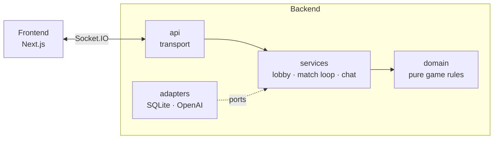

# Nitro Trivia: a real-time multiplayer trivia race

Pick a ride, join the lobby, and race other players through ten trivia
questions. Every correct answer moves your vehicle forward, and faster answers
move it further. Everyone plays live over WebSockets. A player who joins alone
races against bots.

- **Live multiplayer.** A shared lobby countdown, then every player sees the
  same question at the same moment and the race standings update as answers
  land.
- **Three lifelines per game.** *50:50* removes two wrong options. *Double
  score* doubles the points for one answer. *Phone a friend* pauses the clock
  for everyone while an LLM "friend" gives a (funny, not always confident)
  hint.
- **In-game chat** with unread counters, plus sound effects for answers, wins
  and the countdown.
- **Bots** with easy, medium and hard profiles keep solo players company.

| | |
| --- | --- |
| Backend | Python 3.11+, asyncio, aiohttp, python-socketio, SQLite, pydantic-ai (OpenAI) |
| Frontend | Next.js 16 (app router), React 19, socket.io-client, CSS modules |
| Quality | pytest (unit + wire-protocol contract tests), ruff, node:test, ESLint, GitHub Actions |

## Architecture at a glance



The backend follows a ports-and-adapters layout:
- **Domain** holds the game rules as pure, synchronous code with an injected
  clock and RNG.
- **Services** decide *when* things happen.
- **Adapters** implement storage and the LLM.
- **API** is the only layer that knows Socket.IO and the JSON wire format.

On the frontend, every server event is one case of a pure reducer.

Read more:
- [docs/ARCHITECTURE.md](docs/ARCHITECTURE.md): layers, the request path, the
  concurrency model, testing strategy and design decisions
- [docs/PROTOCOL.md](docs/PROTOCOL.md): every Socket.IO event and payload
- [Frontend/README.md](Frontend/README.md): client structure and conventions
- [Backend/tools/question_bank/README.md](Backend/tools/question_bank/README.md):
  the LLM pipeline that builds the question set

## Quick start

You need Python 3.11+ and Node.js 20.9+.

**Backend** (http://localhost:8080):

```bash
cd Backend
python3 -m venv .venv
source .venv/bin/activate          # Windows: .venv\Scripts\activate
pip install -r requirements.txt
cp .env.example .env               # optional: set OPENAI_API_KEY to enable "phone a friend"
python server.py
```

On first start, the server builds its question database from
`Backend/data/questions.csv`.

**Frontend** (http://localhost:8081), in a second terminal:

```bash
cd Frontend
npm ci
npm run dev
```

Open http://localhost:8081 in two browser windows to race yourself, or in one
to race the bots.

Sound effects are not part of the repository, and the game runs fine without
them. To enable them, add these mp3 files to `Backend/sounds/`: `click`,
`click_possible_answer`, `submit_answer`, `correct_answer`, `wrong_answer`,
`no_answer`, `call_friend`, `ticking_clock`, `game_countdown`, `chat_message`
and `win_game`.

Every setting (ports, CORS, timings, file paths, model names) is documented in
[Backend/.env.example](Backend/.env.example). To point the client at another
server, use [Frontend/.env.example](Frontend/.env.example).

## Tests and checks

```bash
cd Backend
pip install -r requirements-dev.txt
pytest                             # unit + contract tests
ruff check . && ruff format --check .

cd ../Frontend
npm test                           # reducer and helper tests (node:test)
npm run lint
npm run build
```

CI runs all of these on every push and pull request
([.github/workflows/ci.yml](.github/workflows/ci.yml)).

## Repository layout

```
Backend/
├── server.py              entrypoint (`python server.py` or `python -m trivia`)
├── trivia/
│   ├── domain/            pure rules: match, timer, scoring, lifelines, bots, vehicles
│   ├── services/          lobby, match loop, chat; ports.py defines what they need
│   ├── adapters/          SQLite question bank and chat, OpenAI phone-a-friend
│   ├── api/               Socket.IO handlers, events, payloads, sounds, HTTP
│   ├── app.py             composition root: create_app()
│   └── config.py          Settings from the environment
├── data/questions.csv     the question set (the database is built from it)
├── tools/question_bank/   offline LLM pipeline: generate → check → dedupe → build
└── tests/                 unit/, contract/ (wire protocol), tools/
Frontend/
├── app/                   the route: picks the screen for the current phase
├── components/            welcome/, matchmaking/, game/, results/
├── hooks/                 useTriviaGame (socket + side effects), useSoundEffects
├── lib/                   protocol, gameReducer, config, vehicles, race helpers
└── tests/                 node:test suites
docs/                      architecture and protocol reference
```
