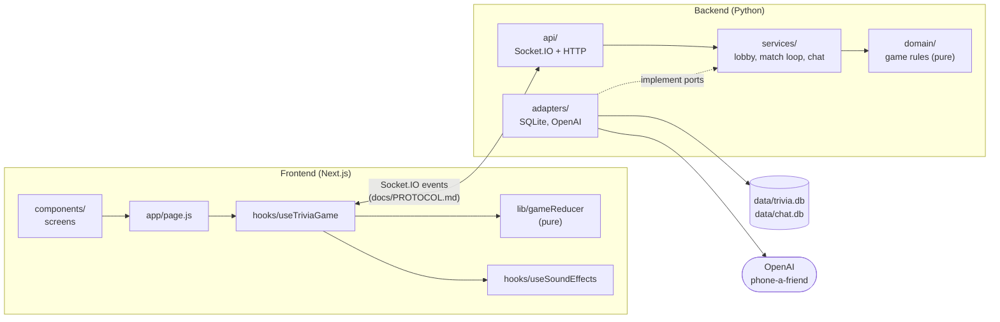

# Architecture

The game has two parts that talk only over Socket.IO:

- **Backend.** A Python asyncio server (aiohttp + python-socketio). It runs the
  lobby and every match, and it decides every rule: timing, scoring,
  lifelines, bots and chat.
- **Frontend.** A Next.js client that renders whatever the server says.

## Backend

### Layers

| Layer | Folder | Responsibility | May import |
| --- | --- | --- | --- |
| Domain | `trivia/domain/` | The rules of the game as plain, synchronous Python: players, questions, scoring, the pausable question timer, lifelines, bot behaviour and the `Match` aggregate. The clock and random numbers are passed in. | the standard library |
| Services | `trivia/services/` | When things happen: the lobby countdown, running a match round by round, answers and lifelines from concurrent players, disconnects, chat. Talks to the outside world only through the ports in `services/ports.py`. | domain |
| Adapters | `trivia/adapters/` | Implementations of the ports: the SQLite question bank (built from `data/questions.csv` on first start), the SQLite chat store, and the OpenAI "phone a friend". | domain, `services/ports.py` |
| API | `trivia/api/` | The transport: Socket.IO handlers, event names, wire payloads, sounds and HTTP routes. The only layer that knows JSON shapes, rooms or Socket.IO. | services, domain |

`trivia/app.py` is the **composition root**. `create_app()` is the only place
that knows every concrete class, and it wires them together. Tests call
`create_app()` with fakes for the question bank, chat store, friend advisor,
randomness and bot speed. `trivia/config.py` holds a single frozen `Settings`
object read from the environment (see `Backend/.env.example`).

The dependency rule is `api → services → domain`, with `adapters → ports`. It
keeps the game rules free of I/O, so they can be tested in microseconds with a
fake clock, and it keeps each concern in exactly one place:

| If you want to change... | ...edit |
| --- | --- |
| a rule (scoring, what a lifeline does, answer validation) | `domain/` |
| timing or orchestration (when rounds end, how bots are scheduled) | `services/game_service.py`, `services/matchmaking.py` |
| what the client receives (payload keys, who gets which event, sounds) | `api/serializers.py`, `api/publisher.py` |
| storage or the LLM provider | `adapters/` |

### The ports

`services/ports.py` defines four `typing.Protocol`s:

- **`QuestionBank`** draws N random questions.
- **`ChatStore`** saves messages, keeps unread counters, and deletes a match's chat.
- **`FriendAdvisor`** gives the phone-a-friend answer.
- **`GameEvents`** is what happened, in game terms: `match_started`,
  `answer_accepted`, `timer_paused`, `round_finished` and so on.

`GameEvents` is the interesting one. Services never build payloads or pick
recipients. They say *what happened* and pass domain objects. The Socket.IO
implementation, `api/publisher.py`, decides who hears it (the match room or
one player), which sound effect plays, the payload (via `api/serializers.py`),
and the order of the emits. Because of this, the whole wire format lives in two
files, and the services can be tested with a recording fake.

### A request, end to end

A player answers a question:

1. `api/socket_handlers.py` receives `answer`, reads the payload defensively,
   and calls `GameService.submit_answer(player_id, question_id, option)`.
2. `GameService` finds the player's match through the `GameRegistry` and asks
   the domain: `Match.submit_answer(...)`.
3. `Match` applies the rules in the original order: is the round open for this
   player, is the option valid and not removed by their fifty-fifty, is the
   question current? It then scores the answer with the timer's remaining time
   and returns an `AnswerOutcome`, or `None` when the request is ignored.
4. `GameService` reports `answer_accepted` and `standings_changed`, then wakes
   the round loop so it can end the round early if everyone has answered.
5. `SocketIOGameEvents` emits `sound_effect` to the room, `answer_received` to
   the player, and `race_standings` to the room.

### Running a match: the concurrency model

Everything runs on one asyncio event loop, and there are no threads apart from
SQLite calls, which use `asyncio.to_thread` so they never block it.

- **Lobby.** The first `join_queue` starts a countdown task in `Matchmaker`.
  When it ends, the whole queue becomes one lineup. A player who is alone gets
  1–3 bots.
- **Setup.** `GameService.start_match` draws the questions *before* the match
  exists, so a failure leaves nothing half-started and the players get an
  `error_message`. While the questions are being drawn, the lineup is *held* in
  the registry, so a disconnect in that window is not lost and nobody can queue
  twice.
- **One task per match.** Each match runs `_play()` in its own task: start a
  round, schedule the bots, wait for the round to end, close it, publish the
  results, pause briefly, and move on to the next question.
- **Waiting without polling.** Answers, disconnects and friend calls arrive
  concurrently from socket handlers. Each one updates the `Match` and sets the
  match's `round_changed` event. The loop wakes up and asks the domain whether
  the round is over: everyone connected has answered, the timer expired, or no
  human is left.
- **Pausable timer.** `QuestionTimer` is pure. Phone-a-friend pauses it, and
  the call is *bound to its round*: if the round ended while the friend was
  thinking, the late reply does not resume the next question's timer.
- **Bots** are ordinary `Player`s with a `BotBrain`. Each round, the brain
  plans a delay and an option, and a short-lived task submits the answer
  through the same `Match.submit_answer` path as humans. The match keeps
  references to these tasks and cancels them when the round closes.
- **Abandoned matches.** When the last human disconnects, the match stops
  immediately instead of letting bots play to an empty room. It then cleans up:
  registry, chat and Socket.IO rooms.
- **Shutdown.** The app's cleanup hook cancels the lobby countdown and every
  running match.

### Data

| Data | Where | Lifetime |
| --- | --- | --- |
| Questions | `data/questions.csv` (in git) → `data/trivia.db` | The CSV is the source of truth. The database is built from it on first start and can be rebuilt with `python -m tools.question_bank.build_database`. |
| Chat | `data/chat.db` | Per match. A match's messages are deleted when it ends. |
| Lobby, matches, scores | memory | Per process. A restart ends running games. |

`tools/question_bank/` is the offline LLM pipeline that grows and cleans the
question CSV: generate, check answers, deduplicate, build the database. See its
README.

## Frontend

The client is built around one idea: **each server event is one reducer
case.**

- `hooks/useTriviaGame.js` owns the socket. It dispatches every server event
  to the reducer, using the event's wire name as the action type. It also
  performs that event's side effects: sounds, the question clock, chat
  scrolling, and messages back to the server.
- `lib/gameReducer.js` holds all game state and every transition, as a pure
  function. It is unit-tested event by event in Node with no browser.
- `app/page.js` only chooses the screen for the current phase (`intro`,
  `waiting`, `game`, `result` or `finished`). The screens live in
  `components/` by feature.

[`Frontend/README.md`](../Frontend/README.md) has the full layout and
conventions.

## Testing strategy

| Suite | Guards | Speed |
| --- | --- | --- |
| `Backend/tests/unit/` for domain | Every rule: scoring, timer pause and resume with a fake clock, answer validation order, lifelines, leaderboard ties, bots with a seeded RNG | instant |
| `Backend/tests/unit/` for services | Orchestration with in-memory fakes: round ends, bots, phone-a-friend timeouts, refunds and late replies, disconnects, abandoned matches, lobby countdown | seconds |
| `Backend/tests/unit/` for adapters and API | SQLite stores on temporary files, serializers' payload keys, app start-up on a fresh clone (no database, no sounds folder) | fast |
| `Backend/tests/contract/` | **The wire protocol.** Real Socket.IO clients play scripted games (every lifeline, chat, a disconnect, a timeout, a solo game with bots) against `create_app()`. Event names, payload shapes and each client's event order must match a baseline recorded from the original server. | ~10 s |
| `Backend/tests/tools/` | The question pipeline's pure helpers (CSV re-indexing, answer parsing, duplicate selection) | instant |
| `Frontend/tests/` | Reducer transitions for every server event and player action, plus helper and catalogue invariants | instant |

The contract test is what made the refactor safe. It was committed first,
passing against the original monolithic `server.py`, and it stayed green
through every later commit.

## Design decisions and trade-offs

- **Ports and adapters, without a framework.** Plain classes and
  `typing.Protocol`, wired by hand in `create_app()`. For an app this size, a
  DI container or ORM would cost more than it gives.
- **Semantic game events rather than emitting dicts.** The services say what
  happened, and the API layer owns the wire format. This is why the frozen
  protocol could survive a complete rewrite of the game loop.
- **A pure `Match` aggregate.** All rules sit in one synchronous object with an
  injected clock and RNG, so the hardest logic (pausable timers, lifeline edge
  cases) is tested deterministically.
- **SQLite and in-memory state.** The server is a single process by design.
  Running several instances would need a shared registry and a Socket.IO
  message queue (for example, Redis). The ports keep that change contained in
  adapters and `create_app()`.
