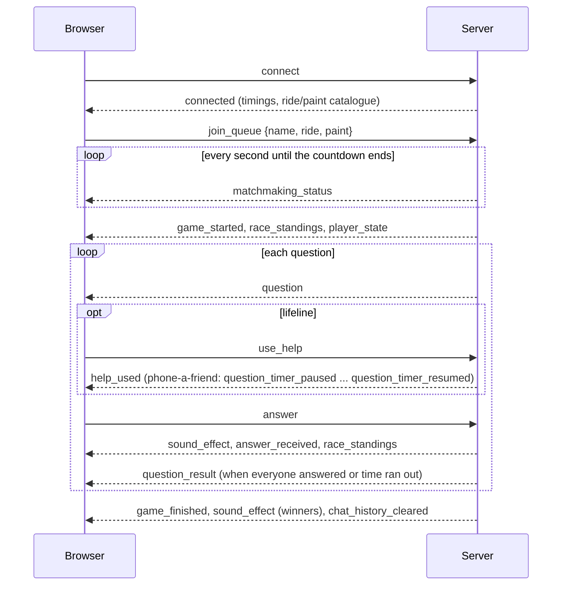

# Socket.IO protocol

Every interaction between the browser and the game server is a Socket.IO event.
The names live in two mirrored files: `Backend/trivia/api/events.py` and
`Frontend/lib/protocol.js`. Payload shapes are produced in one place,
`Backend/trivia/api/serializers.py`.

The protocol is pinned by a contract test (`Backend/tests/contract/`). It
replays scripted games against a running server and compares every event name,
payload shape and per-client event order with `protocol_baseline.json`. That
baseline was recorded from the original server before the refactor. Change it
only when you mean to change the protocol, and change the frontend in the same
commit.

Conventions:

- Game payloads use `camelCase`. Chat payloads use `snake_case`, the shape the
  chat UI was first built with.
- A player is identified by their Socket.IO session id (`sid`). Bots get a
  random UUID instead.
- Requests the server considers invalid or stale are ignored without a reply,
  for example an answer to an old question or an unknown option. Only rule
  violations the player should hear about produce an `error_message`.

## A game, from the client's point of view

## Client → server

| Event | Payload | Effect |
| --- | --- | --- |
| `join_queue` | `{name, ride?, paint?}` | Join the lobby. The first player starts the countdown. The name is trimmed and cut to 24 characters. Unknown rides and paints fall back to the defaults. |
| `leave_queue` | none | Leave the lobby. The countdown stops when the lobby empties. |
| `answer` | `{questionId, option}` | Answer the current question with `"A"` to `"D"`. Only the first valid answer counts. |
| `use_help` | `{questionId, helpType}` | Use a lifeline: `fifty_fifty`, `double_score` or `call_a_friend`. Each one can be used once per game, before answering. |
| `chat_send_message` | `{game_id, content}` | Post to your match's chat. The content must be a non-empty string of at most 500 characters. |
| `chat_open` | `{game_id}` | Mark your match's chat as read. |
| `chat_request_history` | `{game_id}` | Ask for your match's chat history. |

Chat requests from anyone who is not a player of that running match are ignored.

## Server → client

"Room" means every player in the match; "player" means one recipient.

### Connection and lobby

| Event | To | Payload |
| --- | --- | --- |
| `connected` | player | `{sid, matchmakingSeconds, questionSeconds, questionsPerGame, profileChoices: {rides: [{id, label}], paints: [{id, label, hex}], defaults: {ride, paint}}}` |
| `matchmaking_status` | each waiting player | `{secondsLeft, playerCount, players: [name], playerProfiles: [Profile]}` |
| `error_message` | player | `{message}`. Possible messages: `"Username is required to start the game."`, `"You are already in a game."`, `"The game could not start. Please try again."`, `"You already used that help."`, `"Someone is already calling a friend."`, or the reason a phone-a-friend call failed (the lifeline is refunded). |

`Profile` is `{id, name, ride, rideLabel, paint, paintLabel, paintHex, isBot}`.

### Match

| Event | To | Payload |
| --- | --- | --- |
| `game_started` | room | `{gameId, players: [name], playerProfiles: [Profile], questionCount, questionSeconds, raceStandings}` |
| `player_state` | each human | `{helps: Helps, profile: Profile}` |
| `race_standings` | room | `RaceStandings`, sent whenever a score or a connection changes |
| `question` | room | `{id, index, total, topic, difficulty, text, seconds, options: [{key, text}]}`. `index` is 1-based. |
| `answer_received` | player | `{questionId, selectedOption}` |
| `help_used` | player | `{helpType, questionId, helps: Helps}` plus, by lifeline: `removedOptions: [key, key]` (fifty-fifty), `doubleScoreActive: true` (double score), or `confidence, message, friendAnswered` (phone a friend) |
| `question_timer_paused` | room | `{questionId, secondsLeft, callerId, callerName, message}`, sent while someone is on the phone with a friend |
| `question_timer_resumed` | room | `{questionId, secondsLeft}` |
| `question_result` | room | `{questionId, correctOption, correctAnswer, answers: [{playerId, name, ride, paint, selectedOption, isCorrect, doubleScoreUsed, pointsEarned}], leaderboard: [LeaderboardRow], raceStandings}` |
| `game_finished` | room | `{leaderboard: [LeaderboardRow], questionCount, raceStandings}` |
| `sound_effect` | room or player | `{name, url}`. `submit_answer` goes to the room when a human answers, `chat_message` to everyone except the sender, and `win_game` to each winner. `url` is relative to the server, under `/sounds/`. |

- `Helps` is `{fiftyFifty, doubleScore, callFriend}`, each `true` while the lifeline is still available.
- `RaceStandings` is `{finishScore, players: [{id, name, ride, rideLabel, paint, paintLabel, paintHex, score, progressRatio, connected, isBot}]}`.
- `LeaderboardRow` is `{id, name, ride, rideLabel, paint, paintLabel, paintHex, score, connected}`, sorted by score (highest first), then by name.

### Chat

| Event | To | Payload |
| --- | --- | --- |
| `chat_new_message` | room | `{id, game_id, user_id, username, content, timestamp}` (`timestamp` is `HH:MM`) |
| `chat_unread_update` | player | `{unread_count}` |
| `chat_history` | player | `[{id, username, content, timestamp, is_own}]`, oldest first |
| `chat_history_cleared` | room | `{}`, sent when the match ends. The match's messages are then deleted. |

## Scoring

A correct answer scores `300 + 300 × (time left / question time)`, so up to
600 points. Double score doubles it (once per game), and a wrong answer scores
nothing. The race track's finish line is at `(questions + 1) × 600` points: a
perfect, instant game that uses double score lands exactly on it.
`progressRatio` is `score / finishScore`, clamped to `[0, 1]`.

## HTTP

| Route | Response |
| --- | --- |
| `GET /` | Health check: `{status: "ok", waitingPlayers, activeGames, dbPath}` |
| `GET /sounds/<file>` | Sound effects, served only when `SOUNDS_DIR` exists |
